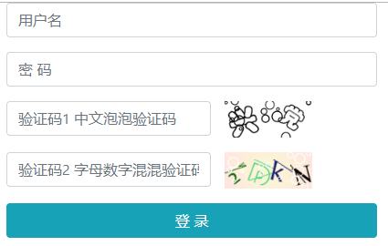

# Hei.Captcha

一个.net core，跨平台的图形验证码生成工具包，基于[ImageSharp](https://github.com/SixLabors/ImageSharp)。


## 中文泡泡验证码


## 字母数字组合验证码


## 表单Demo




## 使用

```
Install-Package Hei.Captcha
```


```
/// <summary>
/// 泡泡中文验证码 
/// </summary>
/// <returns></returns>
public IActionResult BubbleCode()
{
    var code = _securityCode.GetRandomCnText(2);
    var imgbyte = _securityCode.GetBubbleCodeByte(code);

    return File(imgbyte, "image/png");
}

/// <summary>
/// 数字字母组合验证码
/// </summary>
/// <returns></returns>
public IActionResult HybridCode()
{
    var code = _securityCode.GetRandomEnDigitalText(4);
    var imgbyte = _securityCode.GetEnDigitalCodeByte(code);

    return File(imgbyte, "image/png");
}
```

### 高级

参照Demo， 通过修改/丰富应用程序运行目录`./fonts`目录下的字体文件，生成更多不同字体组合的验证码。
