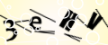
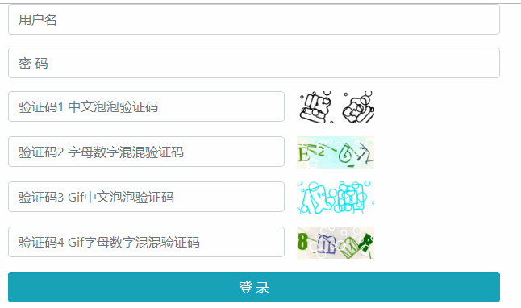

# Hei.Captcha

[](https://www.nuget.org/packages/Hei.Captcha/)

.net core，跨平台的验证码生成工具包，支持动态gif验证码。基于[ImageSharp](https://github.com/SixLabors/ImageSharp)。


> 使用.NET Standard 2.0，目前仅测试过.net core的支持，.net frameword 4.6.1 及以上请自行测试~


## 中文泡泡验证码


## 字母数字组合验证码





## 动态gif中文泡泡验证码


## 动态gif字母数字组合验证码


## 表单示例




## 使用

```
Install-Package Hei.Captcha
```


```
//StartUp.cs,Method ConfigureServices()
services.AddHeiCaptcha();
```


```
private readonly SecurityCodeHelper _securityCode;

public HomeController(SecurityCodeHelper securityCode)
{
	this._securityCode = securityCode;
}

/// <summary>
/// 泡泡中文验证码 
/// </summary>
/// <returns></returns>
public IActionResult BubbleCode()
{
    var code = _securityCode.GetRandomCnText(2);
    var imgbyte = _securityCode.GetBubbleCodeByte(code);

    return File(imgbyte, "image/png");
}

/// <summary>
/// 数字字母组合验证码
/// </summary>
/// <returns></returns>
public IActionResult HybridCode()
{
    var code = _securityCode.GetRandomEnDigitalText(4);
    var imgbyte = _securityCode.GetEnDigitalCodeByte(code);

    return File(imgbyte, "image/png");
}

/// <summary>
/// gif泡泡中文验证码 
/// </summary>
/// <returns></returns>
public IActionResult GifBubbleCode()
{
    var code = _securityCode.GetRandomCnText(2);
    var imgbyte = _securityCode.GetGifBubbleCodeByte(code);

    return File(imgbyte, "image/gif");
}

/// <summary>
/// gif数字字母组合验证码
/// </summary>
/// <returns></returns>
public IActionResult GifHybridCode()
{
    var code = _securityCode.GetRandomEnDigitalText(4);
    var imgbyte = _securityCode.GetGifEnDigitalCodeByte(code);

    return File(imgbyte, "image/gif");
}
```

### 高级

参照Demo， 通过修改/丰富应用程序运行目录`./fonts`目录下的字体文件，生成更多不同字体组合的验证码。


## 公众号

欢迎关注我的公众号。虽然有点懒，不过偶尔打打鸡血还是会写点东西的，你的关注就是我的动力，谢谢支持~~


